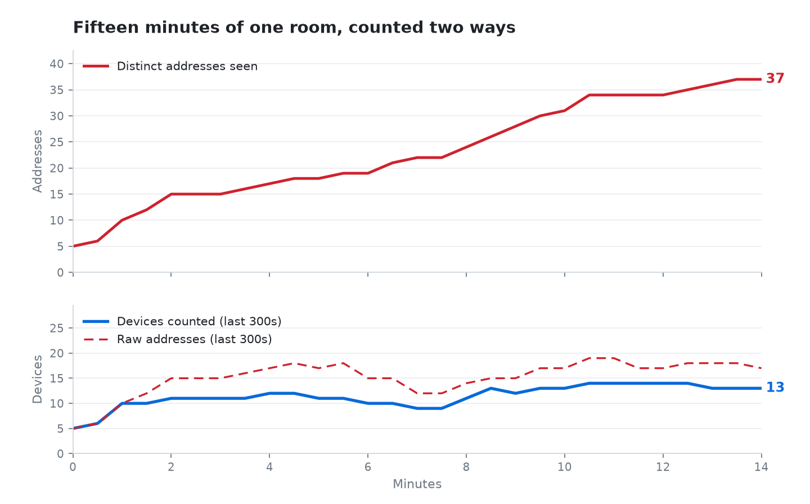

# 📡 probe-sniffer


> *How many people are in this room? Ask their phones.*

Estimate how many devices are nearby by passively listening for the WiFi probe requests phones
broadcast — and get a useful number back even though modern phones randomise their MAC address
specifically to prevent this.

<picture>
  <source media="(prefers-color-scheme: dark)" srcset="./media/live-capture-dark.png">
  
</picture>

**MAC addresses are personal data.** Read [Legal and ethical use](#️-legal-and-ethical-use) before
you run this on anything but your own premises.

## 🌟 Highlights

- **Counts devices, not addresses.** One phone rotating through twenty MACs is counted once.
- **Completely passive.** It only listens — it never transmits and never reads packet contents.
- **A sliding window**, so the number reflects who's here now, not everyone who's walked past.
- **Two capture backends** behind one interface — scapy by default, pyshark as a cross-check.
- **Nothing is stored.** Observations live in memory and are never written to disk.
- **It reports a floor under its own count**, and warns when the radio leaves your chosen channel.

## ℹ️ Overview

Phones broadcast **probe requests** looking for networks they know. Those are unencrypted and carry
a sender address, so counting distinct senders gives you a rough headcount of the radios nearby.

Since iOS 8 and Android 8, phones probe from a **randomised address** and rotate it regularly. Count
raw addresses and the number climbs for as long as you listen.

The fix is to key on something that can't be randomised. A probe request carries a set of
*information elements* — supported rates, capability flags, and the order they appear in — which
belong to the chipset and driver rather than the address, and survive rotation. An address with a
real manufacturer prefix keys on the MAC; a randomised one keys on the fingerprint.

A radio that moves between 2.4 and 5 GHz fingerprints twice, so clusters sharing an address are
joined back together.

Two identical handsets on the same OS version fingerprint alike and merge into one. That undercount
is inherent to the approach, so this gives you roughly how busy a space is rather than an exact
count.

### ✍️ Author

Built by [@NotEoin](https://github.com/NotEoin).

## 🚀 Usage

Put your adapter into monitor mode, then start counting:

```bash
sudo ./setup.sh up wlan1                          # -> wlan1mon
sudo python -m probe_sniffer --iface wlan1mon
```

Real output, from the capture in the figure above — that run used an interface named `mon0`:

```
probe-sniffer started on mon0 via scapy (window=300s, interval=30s, fingerprint-clustering).
Press Ctrl-C to stop.

[17:50:59] devices in vicinity (last 300s): 32  (universal=14, randomized=18, macs-seen=89)  [unique-ever=32]  at least 38: addresses overlap inside a device
[17:51:29] devices in vicinity (last 300s): 31  (universal=14, randomized=17, macs-seen=90)  [unique-ever=32]  at least 37: addresses overlap inside a device
[17:51:59] devices in vicinity (last 300s): 30  (universal=13, randomized=17, macs-seen=91)  [unique-ever=32]  at least 37: addresses overlap inside a device
[17:52:29] devices in vicinity (last 300s): 32  (universal=15, randomized=17, macs-seen=104)  [unique-ever=35]  at least 39: addresses overlap inside a device
```

`macs-seen` climbs from 89 to 104 while the count holds at 30-32. `sudo ./setup.sh down wlan1mon`
restores managed mode when you're finished.

The `at least` figure is a floor beneath the count: a radio uses one address at a time, so two
addresses overlapping inside one counted device mean it is really two.

| Flag | Default | What it does |
|---|---|---|
| `--iface`, `-i` | *required* | Your monitor-mode interface |
| `--backend`, `-b` | `scapy` | `scapy` or `pyshark` |
| `--interval` | `30` | Seconds between count printouts |
| `--window` | `300` | How long a device counts as "here" after being seen |
| `--no-fingerprint` | off | Count raw MACs instead, for comparison |
| `--exclude-randomized` | off | Ignore randomised addresses entirely |
| `--verbose`, `-v` | off | Print every probe request as it arrives, to stderr |

Devices probe in bursts, so a short `--window` drops the quiet ones. Over fifteen minutes:

| `--window` | mean devices reported |
|---|---|
| `60` | 7.5 |
| `300` (default) | 16.1 |
| `900` | 19.7 |

Keep it well short of your capture, or nothing expires and you count everything you ever saw.

### Pinning the interface

A monitor interface only hears the channel it is parked on, and a managed interface sharing the same
radio drags it around as it scans. Every crossing between bands splits a dual-band handset in two.
Pinning alone will not hold it, because NetworkManager and wpa_supplicant retune the radio
underneath you.

```bash
sudo airmon-ng check kill              # stop the scanners retuning the radio
sudo iw dev wlan1mon set freq 2412     # then park on 2.4 GHz channel 1
```

`setup.sh up` runs the first command already; an interface made by hand with `iw` does not, which is
the usual cause of a count that reports crossing bands. Killing those services drops your wireless
connection, so do it from a console. Most phones probe on 2.4 GHz.

## ⬇️ Installation

```bash
git clone https://github.com/NotEoin/mac-sniffer.git
cd mac-sniffer
pip install -e ".[pyshark]"          # also puts a `probe-sniffer` command on your path
```

Or with conda, which pins Python 3.11 and the capture dependencies for you:

```bash
conda env create -f environment.yml
conda activate probe-sniffer
```

`setup.sh` is not an installer — it's the monitor-mode helper used above, and needs `aircrack-ng`
and `iw`:

```bash
sudo apt install aircrack-ng iw     # Debian/Ubuntu
sudo ./setup.sh list                # show wireless interfaces and their modes
```

### Requirements

| | |
|---|---|
| **OS** | Linux |
| **Hardware** | A wireless adapter that supports **monitor mode** — many built-in cards don't |
| **Python** | 3.11 via the conda environment in `environment.yml`; 3.10+ works if you install `scapy` yourself |
| **System** | `aircrack-ng` and `iw`, for `setup.sh` |
| **Permissions** | Root for the scapy backend. The pyshark backend captures from the `wireshark` group without it |
| **Optional** | Wireshark/`tshark` for the pyshark backend |

## ⚖️ Legal and ethical use

**Please read this before you run it.**

Probe requests are broadcast in the clear and this tool only listens. That does not make the data
harmless.

**MAC addresses are personal data** under UK and EU GDPR — they identify a device, and a device
usually identifies a person. The fingerprint clustering makes that worse: its whole purpose is
re-identifying a device across the randomisation meant to prevent it.

- Run it on **premises and networks you own**, or where you have explicit permission.
- **Never** use it to track an individual, follow a specific device, or build a movement history.
- Don't add persistence without a lawful basis. It writes nothing to disk.
- Deploy it where the public passes through and you are processing personal data at scale — you
  need a lawful basis, a privacy notice and most likely a DPIA. "It's only a count" is not a
  defence.
- Monitor mode and passive capture are lawful in most places. **Check yours.**

## 🧭 Limitations

- **A proof of concept.** It prints a number to a terminal every thirty seconds and stops there.
- **It's an estimate.** Identical devices merge; devices with WiFi off are invisible.
- **One channel at a time.** No channel hopping — see above.
- **Accuracy is unvalidated** against a known headcount. Only the clustering has been measured, as
  in the capture above.
- Requires monitor-mode-capable hardware, which rules out most laptops without a USB adapter.
- **Memory grows with the run.** The `unique-ever` total keeps every cluster key it has ever seen,
  so a capture left running for days keeps growing. Restart it periodically.

## 🛠️ Development

```bash
pip install -e ".[dev]"
pytest
```

The tests craft probe requests in memory and feed them to the tracker and the scapy handler, so they
all run without an interface, monitor mode or root.

`tools/` is the scaffolding that produced the figure at the top of this page. It is not part of the
sniffer and is not needed to run one.

| | |
|---|---|
| `tools/plot_capture.py` | Draws the figure from two capture logs. Needs `pip install -e ".[plot]"` |
| `tools/capture/live-capture.sh` | Records both logs end to end and puts the network back afterwards |
| `tools/capture/example-run/` | The counts behind the figure above, so it can be redrawn without a card |

## 💭 Feedback and contributing

Especially interested in accuracy data if you validate it against a real headcount — open an
[issue](https://github.com/NotEoin/mac-sniffer/issues) or start a
[discussion](https://github.com/NotEoin/mac-sniffer/discussions).

## 📄 Licence

MIT — see [LICENSE](LICENSE).
